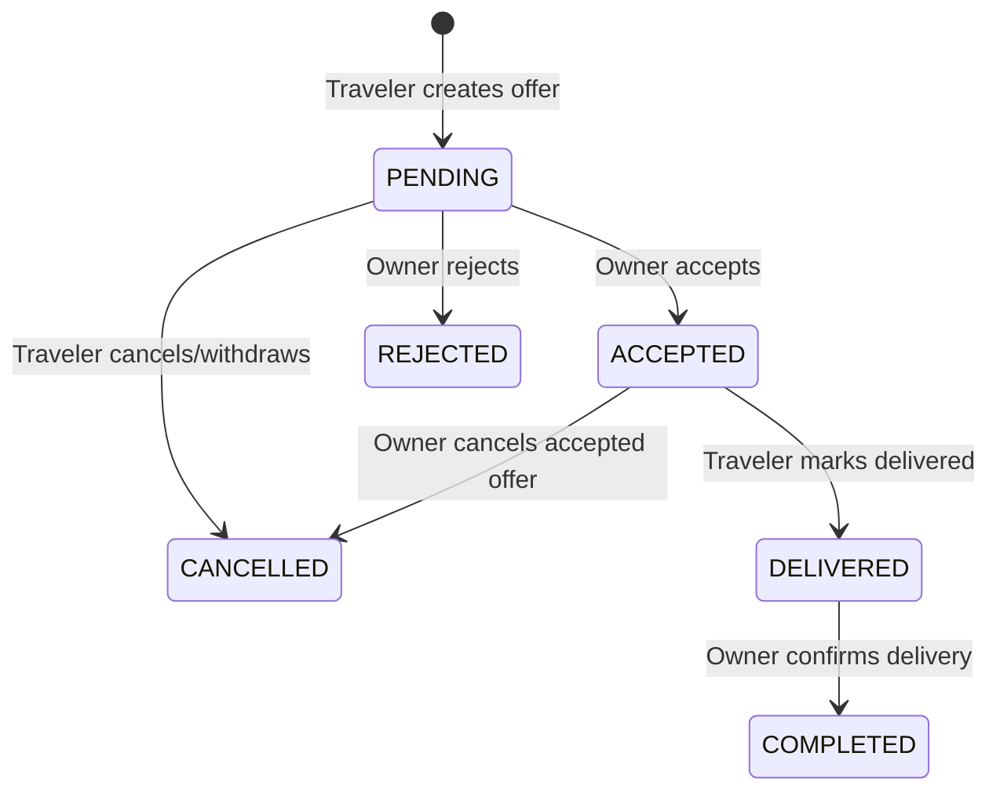
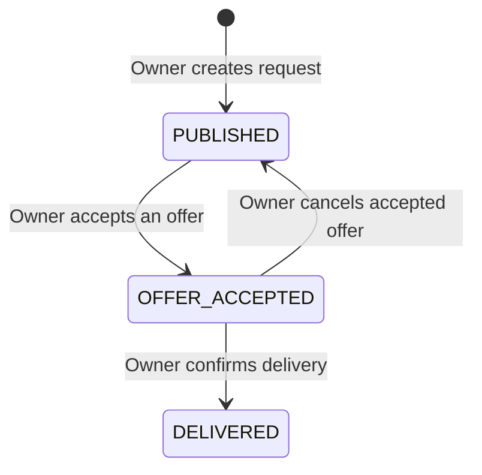

# Shopping Feature — End-to-End Explainer

The shopping feature lets a **user** (request owner) post a shopping request for a product they want purchased and delivered from abroad. Other users — referred to as **travelers** — browse these requests and place **offers** (a commission-based bid). When both parties agree on terms, the system tracks the lifecycle from acceptance through delivery, confirmation, and review. All negotiation happens inside a per-offer chat that is created automatically.

---

## Table of Contents

1. [Data Model](#1-data-model)
2. [Shopping Request Module](#2-shopping-request-module)
3. [Offers Module](#3-offers-module)
4. [End-to-End Flow](#4-end-to-end-flow)
5. [Status State Machines](#5-status-state-machines)
6. [API Quick Reference](#6-api-quick-reference)

---

## 1. Data Model

Source: `prisma/schema.prisma`

### ShoppingRequest

The central entity. Created by the request owner.

| Field | Type | Notes |
|---|---|---|
| `id` | UUID | Primary key |
| `user_id` | UUID | FK → User (the request owner) |
| `version` / `current_version` | Int | Incremented when the request is edited while offers exist |
| `source` | `RequestSource` | `WEBVIEW`, `URL`, or `MANUAL` |
| `deliver_to` | String | Destination city/address |
| `delivery_timeframe` | `DeliveryTimeframe` | `ONE_WEEK`, `TWO_WEEKS`, `ONE_MONTH`, `FLEXIBLE` |
| `product_price` | Decimal | Sum of product prices × quantities |
| `product_currency` | `Currency` | `XAF`, `USD`, `EUR`, `CAD` |
| `traveler_reward` | Decimal | Commission offered to the traveler |
| `platform_fee` | Decimal | 15 % of `product_price` |
| `additional_fees` | Decimal | Extra fees (default 0) |
| `total_cost` | Decimal | `product_price + traveler_reward + platform_fee` |
| `reward_currency` | `Currency` | Currency of the reward |
| `status` | `ShoppingRequestStatus` | See enum below |
| `expires_at` | DateTime? | Auto-set to 60 days from creation |
| `additional_notes` | String? | Free-text from the owner |

**Relations:** `products` → `Product[]`, `offers` → `Offer[]`, `deliveryTracking` → `DeliveryTracking?`, `ratings` → `Rating[]`, `chats` → `Chat[]`.

### Product

One or more products attached to a shopping request.

| Field | Type | Notes |
|---|---|---|
| `shopping_request_id` | UUID | FK → ShoppingRequest |
| `name` | String | Product name |
| `source` | `ProductSource` | `AMAZON`, `SHEIN`, `HM`, `NIKE`, `ZARA`, `APPLE`, `EBAY`, `OTHER` |
| `url` | String? | Original product URL (null for manual) |
| `image_urls` | String[] | Array of image URLs |
| `price` | Decimal | Unit price |
| `price_currency` | `Currency` | |
| `quantity` | Int | Default 1 |
| `variants` | Json? | Size, color, etc. |
| `in_stock` | Boolean | Default true |

### Offer

A traveler's bid on a shopping request.

| Field | Type | Notes |
|---|---|---|
| `id` | UUID | Primary key |
| `shopping_request_id` | UUID | FK → ShoppingRequest |
| `traveler_id` | UUID | FK → User (the traveler) |
| `request_version` | Int | Snapshot of `current_version` at offer time |
| `reward_amount` | Decimal | Proposed reward |
| `reward_currency` | `Currency` | |
| `additional_fees` | Decimal | Shipping/customs proposed by traveler |
| `travel_date` | DateTime? | When the traveler can deliver |
| `message` | String? | Free-text note to owner |
| `status` | `OfferStatus` | See enum below |
| `chat_id` | UUID? | 1:1 FK → Chat (unique) |
| `accepted_at` / `rejected_at` / `cancelled_at` / `delivered_at` | DateTime? | Timestamps per lifecycle event |

**Relations:** `shopping_request` → `ShoppingRequest`, `traveler` → `User`, `chat` → `Chat?`, `purchase_proofs` → `PurchaseProof[]`.

### DeliveryTracking

Auto-created when delivery is confirmed. Tracks confirmation timestamps and potential issues.

### Key Enums

**ShoppingRequestStatus** — lifecycle of the request itself:

```
PUBLISHED → OFFER_ACCEPTED → PAID → BOUGHT → PENDING_DELIVERY → DELIVERED → COMPLETED
                                                                          ↘ DISPUTED
                                                              ↘ CANCELLED
                                               ↘ EXPIRED
```

> The current offers/shopping-request modules drive the **PUBLISHED ↔ OFFER_ACCEPTED → DELIVERED** transitions. Statuses like `PAID`, `BOUGHT`, `PENDING_DELIVERY`, `COMPLETED`, `DISPUTED`, and `EXPIRED` exist in the enum and are set by other subsystems (payments, scheduling, disputes).

**OfferStatus** — lifecycle of each individual offer:

```
PENDING → ACCEPTED → DELIVERED → COMPLETED
       ↘ REJECTED
       ↘ CANCELLED (by traveler)
              ↘ CANCELLED (by owner — reverts request to PUBLISHED)
```

---

## 2. Shopping Request Module

**Module path:** `src/shopping-request/`
**Base route:** `/shopping-request`
**Auth:** All endpoints require JWT (`JwtAuthGuard`).

### 2.1 Creating a Request

There are three creation paths. All produce a request with status **PUBLISHED** and an expiration of 60 days.

| Endpoint | Method | Description |
|---|---|---|
| `/shopping-request` | POST | Body-based creation (webview basket import or structured input). Accepts an array of `products`. |
| `/shopping-request/from-url` | POST | Accepts a product URL. The server scrapes the product page (Amazon, Shein, H&M, Nike, Zara, Apple, eBay) and populates product fields automatically. |
| `/shopping-request/manual` | POST (multipart) | Manual entry with uploaded images (max 6 files, 5 MB each). No product URL required. |

**Cost breakdown calculated on creation:**

- `product_price` = Σ(price × quantity) across all products
- `traveler_reward` = provided value, or 15 % of `product_price` (suggested default)
- `platform_fee` = 15 % of `product_price`
- `total_cost` = `product_price + traveler_reward + platform_fee`

### 2.2 Listing Requests

`GET /shopping-request`

| Query param | Type | Description |
|---|---|---|
| `type` | `my_requests` \| `available` | `my_requests` = current user's requests. `available` = other users' PUBLISHED requests (the traveler feed). |
| `status` | `ShoppingRequestStatus` | Optional filter. |
| `destination` | string | Case-insensitive match on `deliver_to`. |
| `date` | ISO date string | Filter by `created_at` date. |
| `page` / `limit` | number | Pagination (1-indexed, default 10, max 100). |

Response includes `data[]` (requests with products, user info, offer count) and `meta` (total, page, limit, totalPages).

### 2.3 Get One Request

`GET /shopping-request/:id`

Visibility rules:
- **Owner** sees the full request and paginated offers (enriched with traveler rating, completed-request count, time-since-creation).
- **Traveler who has made an offer** sees the request plus only their own offer.
- **Other users** see the request without any offers.

Offer pagination is controlled via query params `offersPage` and `offersLimit` (default page 1, limit 3).

### 2.4 Update Request

`PUT /shopping-request/:id`

- Only the **request owner** can update.
- Only allowed when status is **PUBLISHED**.
- If there are existing PENDING offers, the `current_version` is incremented so old offers stay linked to the previous version.

### 2.5 Get Offers for a Request

`GET /shopping-request/:id/offers`

- **Owner only.** Returns all offers for the given request, ordered by newest first, with basic traveler info (`id`, `username`, `picture`).

### 2.6 Delete

No delete endpoint is currently implemented.

---

## 3. Offers Module

**Module path:** `src/offers/`
**Base route:** `/shopping-offers`
**Auth:** All endpoints require JWT.

### 3.1 Create Offer (Traveler)

`POST /shopping-offers`

**Preconditions:**
- Request must be **PUBLISHED**.
- Caller must **not** be the request owner.
- Caller must not already have an active offer (PENDING/ACCEPTED/DELIVERED/COMPLETED) on this request. A new offer is allowed if the previous one was CANCELLED or REJECTED.
- `deliverBy` date must be valid and before the request's `expires_at`.

**What happens:**
1. A new **SHOPPING** chat is created between the traveler and the request owner. The chat is linked to the `shopping_request_id`.
2. If the traveler includes a `message`, it is sent to the chat.
3. An `Offer` record is created with status **PENDING**, linked to the chat via `chat_id`.
4. An automatic payment-summary message is sent to the chat showing `productPrice`, `shippingAndCustoms`, `reward`, and `totalAmount`.

### 3.2 Get My Offers (Traveler)

`GET /shopping-offers/mine`

Returns all offers created by the authenticated traveler, including basic shopping request info (`deliver_to`, `product_price`, `status`).

### 3.3 Get All Offers (Admin)

`GET /shopping-offers`

Returns all offers in the system with traveler and request info.

### 3.4 Get Offer by ID

`GET /shopping-offers/:id`

Accessible by the **traveler** who created the offer or the **request owner**. Returns full offer details including timestamps.

### 3.5 Cancel Offer (Traveler)

`PUT /shopping-offers/:id`

- **Traveler only.**
- Only **PENDING** offers can be cancelled.
- Sets offer status to **CANCELLED**.
- Sends a cancellation message to the linked chat.

### 3.6 Withdraw Offer (Traveler)

`POST /shopping-offers/:id/withdraw`

A semantic alias for cancel. Internally calls the same `cancelOffer` logic. Exists for client-side clarity (withdraw = retract a pending bid).

### 3.7 Accept Offer (Request Owner)

`POST /shopping-offers/:id/accept`

**Preconditions:**
- Caller must be the request owner.
- Offer must be **PENDING**.
- Request must be **PUBLISHED**.

**What happens (in a single transaction):**
1. All **other** PENDING offers for this request are set to **REJECTED** (with `rejected_at` timestamp). Auto-rejection chat messages are sent to each rejected offer's chat.
2. The target offer is set to **ACCEPTED** (with `accepted_at` timestamp).
3. The shopping request status moves to **OFFER_ACCEPTED**.
4. An acceptance message is sent to the accepted offer's chat, indicating the owner should proceed with payment.

### 3.8 Reject Offer (Request Owner)

`POST /shopping-offers/:id/reject`

- Caller must be the request owner.
- Offer must be **PENDING**.
- Sets offer status to **REJECTED**.
- Sends a rejection message to the chat.
- The shopping request status **stays PUBLISHED** (owner can still accept other offers).

### 3.9 Cancel Accepted Offer (Request Owner)

`POST /shopping-offers/:id/cancel`

- Caller must be the request owner.
- Only **ACCEPTED** offers can be cancelled by the owner.
- Sets offer to **CANCELLED**.
- Reverts the shopping request status back to **PUBLISHED** (re-opens it for new offers).

### 3.10 Mark Delivered (Traveler)

`POST /shopping-offers/:id/deliver`

- **Traveler only.**
- Offer must be **ACCEPTED**.
- Sets offer status to **DELIVERED** with `delivered_at` timestamp.
- Sends a delivery-report message to the chat indicating the owner needs to confirm receipt. Includes a breakdown of traveler earnings, product price, and total amount.

### 3.11 Confirm Delivery (Request Owner)

`POST /shopping-offers/:id/confirm-delivery`

- Caller must be the request owner.
- Offer must be **DELIVERED**.
- Sets offer status to **COMPLETED**.
- Sets shopping request status to **DELIVERED** with `delivered_at` timestamp.
- Sends a completion message to the chat and prompts the owner to leave a review.

### 3.12 Get Chat for Offer

`GET /shopping-offers/:id/chat`

Accessible by either the **traveler** or the **request owner**. Returns the chat object linked to the offer (including request/trip metadata via `ChatService`).

### 3.13 Leave a Review (Request Owner)

`POST /shopping-offers/:id/review`

- Caller must be the request owner.
- Creates a `Rating` record: `giver_id` = owner, `receiver_id` = traveler, linked via `shopping_request_id`.
- One rating per (giver, receiver, shopping_request) combination.
- Body: `{ rating: number, review?: string }`.

---

## 4. End-to-End Flow

Below is the full happy-path journey from creation to review.

### Step 1 — Owner Creates a Shopping Request

The owner submits a request via one of the three creation endpoints. The system calculates costs and publishes the request with status **PUBLISHED**. It appears in the traveler feed.

### Step 2 — Travelers Browse the Feed

Travelers call `GET /shopping-request?type=available` to see all PUBLISHED requests from other users. They can filter by destination, date, or status.

### Step 3 — Traveler Places an Offer

A traveler calls `POST /shopping-offers` with the request ID, proposed reward, delivery date, and an optional message. The system:
- Creates a **PENDING** offer linked to the request's `current_version`.
- Creates a **SHOPPING** chat between the traveler and the owner.
- Sends a payment-summary message to the chat.

The owner is now notified via the chat.

### Step 4 — Owner Reviews and Accepts an Offer

The owner views incoming offers on their request (`GET /shopping-request/:id` or `GET /shopping-request/:id/offers`). Each offer shows the traveler's proposed reward, delivery date, rating, and completed-request count.

When the owner accepts an offer (`POST /shopping-offers/:id/accept`):
- The accepted offer moves to **ACCEPTED**.
- All other PENDING offers are auto-**REJECTED** with chat notifications.
- The request moves to **OFFER_ACCEPTED**.
- An acceptance message is sent to the chat.

> **Alternative paths at this stage:**
> - Owner **rejects** an offer → offer becomes REJECTED; request stays PUBLISHED.
> - Traveler **cancels/withdraws** their own offer → offer becomes CANCELLED; request stays PUBLISHED.

### Step 5 — (Optional) Owner Cancels the Accepted Offer

If the owner changes their mind after accepting, they can call `POST /shopping-offers/:id/cancel`. The offer is set to **CANCELLED** and the request reverts to **PUBLISHED**, allowing new offers.

### Step 6 — Traveler Marks Delivery

Once the traveler has purchased and delivered the product, they call `POST /shopping-offers/:id/deliver`. The offer moves to **DELIVERED** and a delivery-report message is sent to the chat, asking the owner to confirm receipt.

### Step 7 — Owner Confirms Delivery

The owner verifies receipt and calls `POST /shopping-offers/:id/confirm-delivery`. This:
- Sets the offer to **COMPLETED**.
- Sets the request to **DELIVERED** with a `delivered_at` timestamp.
- Sends a completion message and prompts the owner to review the traveler.

### Step 8 — Owner Leaves a Review

The owner calls `POST /shopping-offers/:id/review` with a numeric rating and optional text review. A `Rating` record is created linking the owner (giver) to the traveler (receiver) for this shopping request.

---

## 5. Status State Machines

### Offer Status Transitions



### Shopping Request Status Transitions



> Statuses `PAID`, `BOUGHT`, `PENDING_DELIVERY`, `COMPLETED`, `DISPUTED`, and `EXPIRED` exist in the `ShoppingRequestStatus` enum and are managed by other subsystems (payments, scheduling, disputes) outside the scope of the shopping-request and offers modules documented here.

---

## 6. API Quick Reference

### By Actor: Request Owner

| Action | Method | Endpoint | Required Offer Status | Required Request Status |
|---|---|---|---|---|
| Create request | POST | `/shopping-request` | — | — |
| Create request from URL | POST | `/shopping-request/from-url` | — | — |
| Create request manually | POST | `/shopping-request/manual` | — | — |
| List my requests | GET | `/shopping-request?type=my_requests` | — | — |
| View request (with offers) | GET | `/shopping-request/:id` | — | — |
| Update request | PUT | `/shopping-request/:id` | — | PUBLISHED |
| Get offers for request | GET | `/shopping-request/:id/offers` | — | — |
| Accept offer | POST | `/shopping-offers/:id/accept` | PENDING | PUBLISHED |
| Reject offer | POST | `/shopping-offers/:id/reject` | PENDING | — |
| Cancel accepted offer | POST | `/shopping-offers/:id/cancel` | ACCEPTED | — |
| Confirm delivery | POST | `/shopping-offers/:id/confirm-delivery` | DELIVERED | — |
| Leave review | POST | `/shopping-offers/:id/review` | — | — |

### By Actor: Traveler

| Action | Method | Endpoint | Required Offer Status | Required Request Status |
|---|---|---|---|---|
| Browse available requests | GET | `/shopping-request?type=available` | — | — |
| View a request | GET | `/shopping-request/:id` | — | — |
| Create offer | POST | `/shopping-offers` | — | PUBLISHED |
| View my offers | GET | `/shopping-offers/mine` | — | — |
| View offer detail | GET | `/shopping-offers/:id` | — | — |
| Cancel offer | PUT | `/shopping-offers/:id` | PENDING | — |
| Withdraw offer | POST | `/shopping-offers/:id/withdraw` | PENDING | — |
| Mark delivered | POST | `/shopping-offers/:id/deliver` | ACCEPTED | — |
| Get offer chat | GET | `/shopping-offers/:id/chat` | — | — |

### By Actor: Admin

| Action | Method | Endpoint |
|---|---|---|
| Get all offers | GET | `/shopping-offers` |
